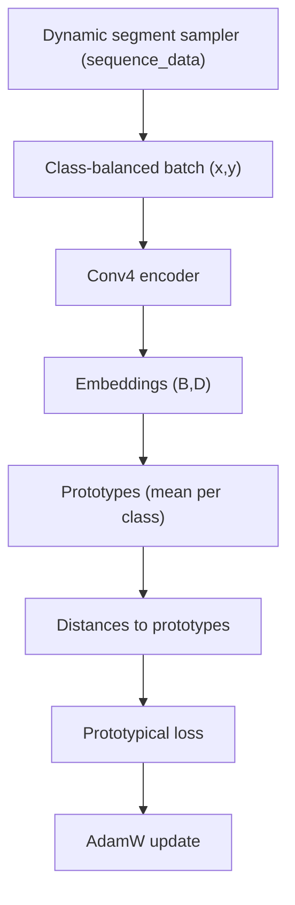

# v1 Architecture

This document describes the v1 ProtoNet model and the current training flow.

## Model (Conv4 encoder)

The encoder mirrors the reference Conv4 design:

- 4x blocks of Conv2d → BatchNorm → ReLU → MaxPool
- Final MaxPool
- Flatten to embedding vector (no FC head, no L2 norm)

```mermaid
flowchart LR
    In["Log-mel spectrogram (B,1,n_mels,T)"] --> C1["Conv2d 1->64, k=3, p=1"]
    C1 --> BN1["BatchNorm2d"]
    BN1 --> R1["ReLU"]
    R1 --> MP1["MaxPool2d 2x2"]
    MP1 --> C2["Conv2d 64->64, k=3, p=1"]
    C2 --> BN2["BatchNorm2d"]
    BN2 --> R2["ReLU"]
    R2 --> MP2["MaxPool2d 2x2"]
    MP2 --> C3["Conv2d 64->64, k=3, p=1"]
    C3 --> BN3["BatchNorm2d"]
    BN3 --> R3["ReLU"]
    R3 --> MP3["MaxPool2d 2x2"]
    MP3 --> C4["Conv2d 64->64, k=3, p=1"]
    C4 --> BN4["BatchNorm2d"]
    BN4 --> R4["ReLU"]
    R4 --> MP4["MaxPool2d 2x2"]
    MP4 --> MP5["MaxPool2d 2x2 (final)"]
    MP5 --> Flat["Flatten (B,D)"]
```

## Training flow (batch-based prototypical loss)

Training uses class-balanced batches. Prototypes are computed inside the loss
function by averaging support samples within each class.

## Notes
- Batches are produced by `DCASEFewShotDataModule` and `IdentityBatchSampler`.
- If `negative_train_contrast=true`, negative samples are concatenated into the batch
  and the loss uses the filtered-negative variant.
