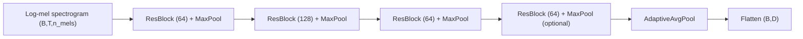
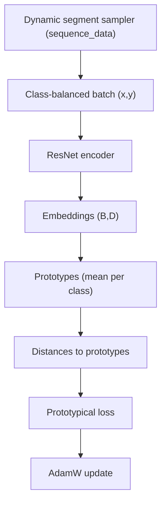

# v1 Architecture

This document describes the v1 ProtoNet model and the current training flow.

## Model (ResNet encoder)

The encoder mirrors the baseline ResNet-style design:

- 4 residual blocks with Conv→BN→ReLU stacks and max pooling
- Optional layer_4 stage
- AdaptiveAvgPool to (time_max_pool_dim, embedding_dim / (time_max_pool_dim * 64))
- Flatten to embedding vector (no FC head, no L2 norm)

## Training flow (batch-based prototypical loss)

Training uses class-balanced batches. Prototypes are computed inside the loss
function by averaging support samples within each class.

## Notes
- Batches are produced by `DCASEFewShotDataModule` and `IdentityBatchSampler`.
- If `negative_train_contrast=true`, negative samples are concatenated into the batch
  and the loss uses the filtered-negative variant.
