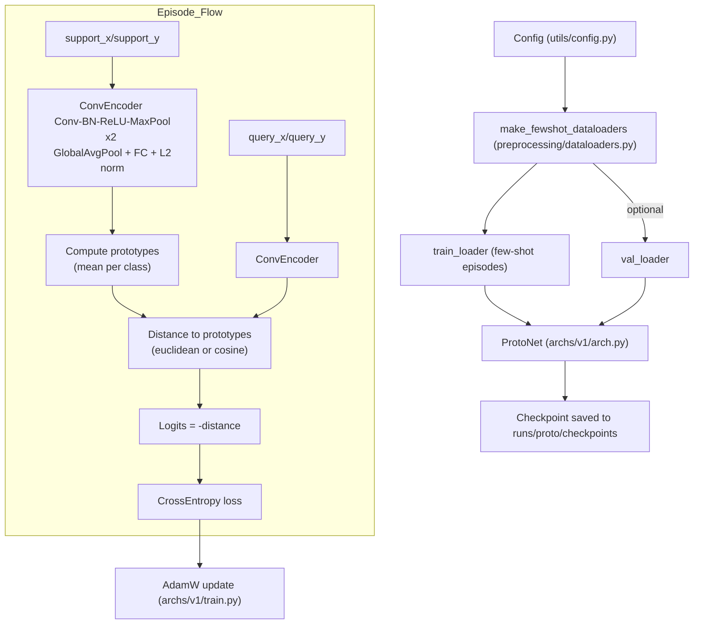
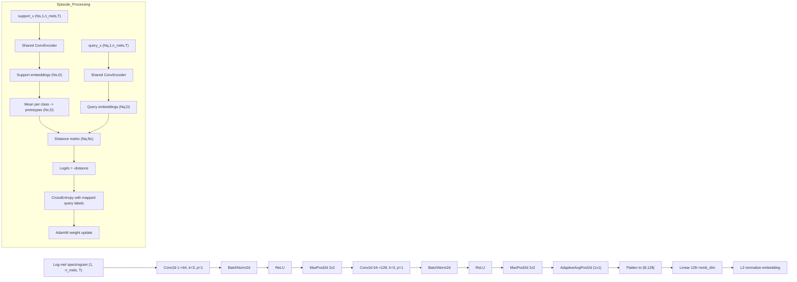

# v1 Architecture

Below is a mermaid diagram describing how the v1 ProtoNet training pipeline is wired together.

## Notes
- Episodes come from `FewShotEpisodeDataset` wrapping `DCASEEventDataset`, sampling `N_WAY` classes with `K_SHOT` support and `N_QUERY` query per class, padded/cropped to `MAX_FRAMES`.
- `ConvEncoder` consumes log-mel spectrograms `(1, n_mels, T)` and outputs L2-normalized embeddings of dimension `EMBEDDING_DIM`.
- Prototypes are class means of support embeddings; distances drive logits, and `cross_entropy` trains the network.
- `train.py` loops over episodes, runs optional validation, and saves checkpoints to `runs/proto/checkpoints`.

## Neural network and data flow (mermaid)

- ConvEncoder shown on top: two Conv-BN-ReLU-MaxPool blocks, global pooling, linear projection, and L2 normalization to produce embeddings.
- Both support and query batches share the same encoder weights; support embeddings are averaged per class to build prototypes.
- Distances (euclidean or cosine) between query embeddings and prototypes become logits; cross-entropy loss drives AdamW updates.
