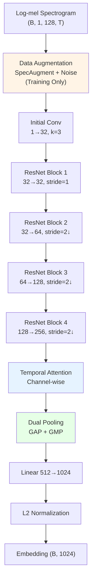
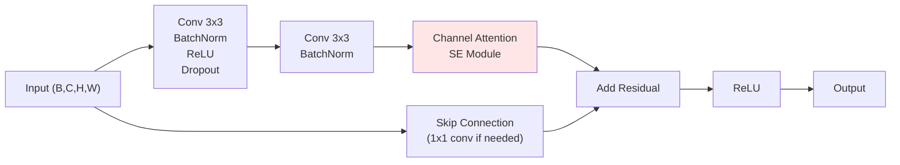
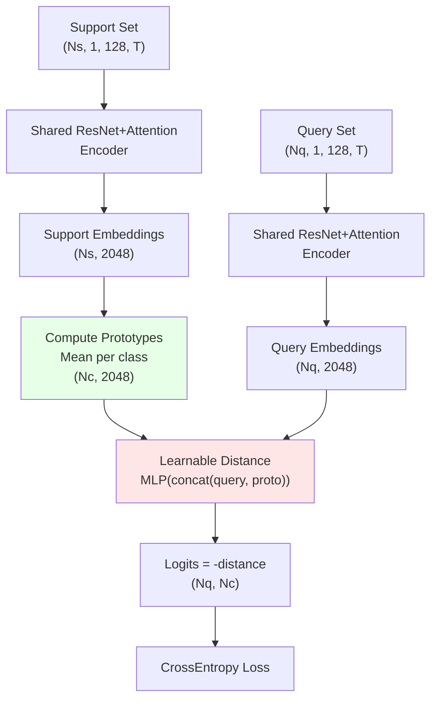

# V2 Architecture: Enhanced Prototypical Network

V2 is a significantly enhanced version of the baseline V1, incorporating state-of-the-art techniques for few-shot bioacoustic classification.

**Optimized for 8GB GPU** with memory-efficient settings while maintaining strong performance.

## Key Improvements Over V1

| Component | V1 | V2 |
|-----------|-----|-----|
| **Encoder** | Simple Conv4 (2 layers) | Deep ResNet with 4 blocks |
| **Attention** | None | Channel + Temporal Attention |
| **Pooling** | Global Average Pool only | Dual Pooling (GAP + GMP) |
| **Distance** | Fixed (Euclidean/Cosine) | Learnable MLP-based |
| **Augmentation** | None | SpecAugment + Gaussian Noise |
| **Scheduler** | Step LR | Cosine Annealing |
| **Gradient Clipping** | None | Yes (1.0) |
| **Residual Connections** | None | Yes (ResNet blocks) |

## Architecture Overview



## ResNet Block with Channel Attention

Each ResNet block includes:



**Channel Attention (Squeeze-and-Excitation):**
1. Global pooling (avg + max) → (B, C)
2. Shared MLP: C → C/16 → C
3. Sigmoid activation → attention weights
4. Multiply features by attention weights

This learns to emphasize important frequency bands for each class.

## Temporal Attention

After the ResNet blocks, temporal attention focuses on important time frames:


This channel-wise temporal attention learns to emphasize important time frames while being computationally efficient.

## Episode Processing Flow



## Learnable Distance Metric

Unlike V1's fixed Euclidean/Cosine distance, V2 uses a learnable MLP:

```python
distance_net = Sequential(
    Linear(2048*2 → 512),
    ReLU + Dropout(0.1),
    Linear(512 → 256),
    ReLU + Dropout(0.1),
    Linear(256 → 1)
)
```

For each query-prototype pair:
1. Concatenate embeddings: [query, proto] → (4096,)
2. Pass through MLP → distance score
3. Compute pairwise distances for all queries and prototypes

**Benefits:**
- Learns what embedding differences matter for classification
- More flexible than fixed metrics
- Can capture complex similarity patterns

## Data Augmentation Pipeline

V2 includes bioacoustic-specific augmentation (only during training):

### SpecAugment
- **Time Masking:** Masks up to 15% of time frames
- **Frequency Masking:** Masks up to 15% of frequency bins
- Applied 2 times each per spectrogram

### Gaussian Noise
- Adds random noise with std=0.01
- Applied with 30% probability
- Simulates recording variations

**Why this helps:**
- Makes model robust to temporal variations
- Prevents overfitting to specific frequency bands
- Simulates real-world recording noise
- Critical for few-shot learning with limited data

## Training Configuration

### Optimizer
- **AdamW** with weight decay 1e-4
- Learning rate: 1e-3
- Gradient clipping: 1.0 (prevents instability)

### Learning Rate Scheduler
- **Cosine Annealing** (vs step decay in V1)
- Smoother decay, better convergence
- T_max = 50 epochs, min_lr = 1e-5

### Episodes
- Training: 2000 episodes/epoch
- Validation: 200 episodes
- Test: 200 episodes
- Configuration: 10-way, 5-shot, 5-query

## Enhanced Evaluation Metrics

V2 includes comprehensive metrics (same as enhanced V1):

- **Macro Precision, Recall, F1-Score:** Overall performance
- **Per-class Accuracy:** Identify problematic species
- **Confusion Matrix:** Detailed error analysis
- **Average Per-class Accuracy:** Class-balanced metric

## Files Structure

```
archs/v2/
├── __init__.py              # Package exports
├── arch.py                  # Core architecture
│   ├── ResNetBlock          # Residual block with channel attention
│   ├── ChannelAttention     # Squeeze-and-Excitation
│   ├── TemporalAttention    # Multi-head attention over time
│   ├── ResNetAttentionEncoder  # Main encoder
│   ├── LearnableDistanceMetric # MLP-based distance
│   └── ProtoNetV2           # Complete model
├── lightning_module.py      # PyTorch Lightning wrapper
│   └── ProtoNetV2LightningModule
├── augmentation.py          # Data augmentation
│   ├── TimeMasking
│   ├── FrequencyMasking
│   ├── SpecAugment
│   ├── RandomGaussianNoise
│   └── BioacousticAugmentation
└── ARCHITECTURE.md          # This file
```

## Usage

### Training from scratch
```bash
python archs/train.py arch=v2
```

### Testing a checkpoint
```bash
python archs/train.py arch=v2 train=false test=true \
    arch.training.load_weight_from=outputs/protonet_baseline/v2_run/checkpoints/epoch_050.ckpt
```

### Custom configuration
```bash
python archs/train.py arch=v2 \
    arch.training.learning_rate=0.0005 \
    arch.augmentation.time_mask_pct=0.2 \
    arch.model.channels=[32,64,128,256]
```

## Expected Performance

Based on similar architectures in literature:

| Metric | V1 Baseline | V2 Expected |
|--------|-------------|-------------|
| Validation Accuracy | ~44% | ~50-55% |
| Test Accuracy | ~67% | ~70-75% |
| Training Time | ~2-3 hours | ~4-5 hours |
| Model Size | ~2 MB | ~11 MB |
| Parameters | 0.5M | 3.0M |
| GPU Memory | ~2 GB | ~4 GB |

**Why V2 is better:**
1. **Deeper encoder** → Better feature learning
2. **Attention mechanisms** → Focus on important regions
3. **Learnable distance** → More flexible similarity
4. **Data augmentation** → Better generalization
5. **Residual connections** → Easier to train

## Research Foundations

V2 incorporates ideas from:
1. **ResNet** (He et al., 2016) - Residual learning
2. **SENet** (Hu et al., 2018) - Channel attention
3. **Transformer** (Vaswani et al., 2017) - Multi-head attention
4. **SpecAugment** (Park et al., 2019) - Audio augmentation
5. **PANNs** (Kong et al., 2020) - Audio neural networks
6. **Prototypical Networks** (Snell et al., 2017) - Few-shot learning

## Troubleshooting

### If training is unstable:
- Reduce learning rate: `arch.training.learning_rate=0.0005`
- Increase gradient clipping: `arch.training.gradient_clip_val=0.5`
- Reduce augmentation: `arch.augmentation.time_mask_pct=0.1`

### If overfitting:
- Increase dropout: `arch.model.dropout=0.2`
- Increase weight decay: `arch.training.weight_decay=1e-3`
- Increase augmentation: `arch.augmentation.time_mask_pct=0.2`

### If underfitting:
- Increase model capacity: `arch.model.channels=[128,256,512,1024]`
- Decrease dropout: `arch.model.dropout=0.05`
- Train longer: `arch.training.max_epochs=100`

