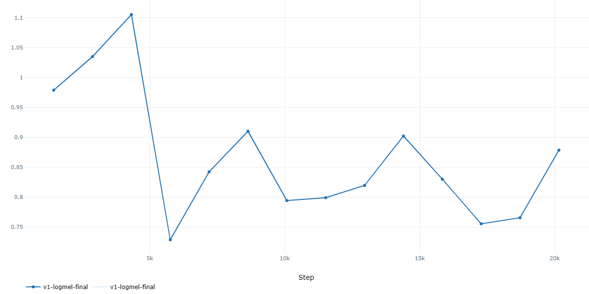
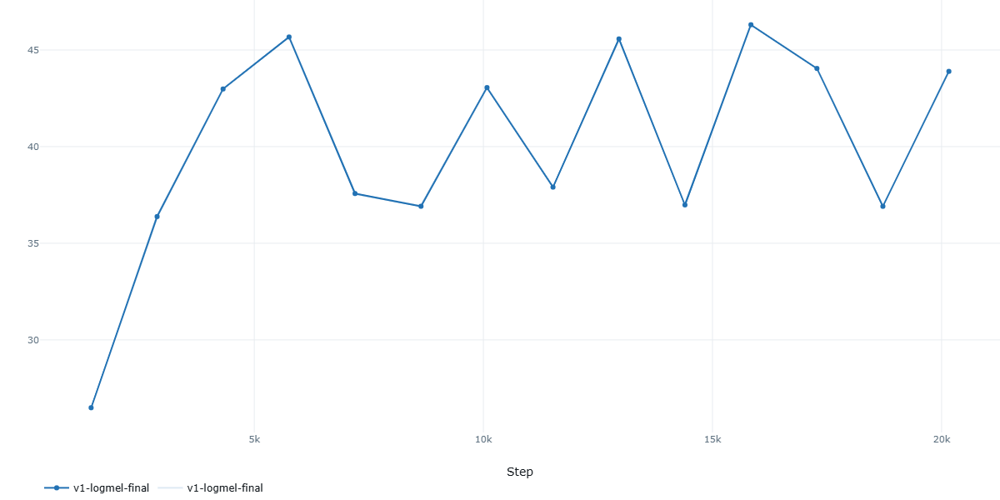
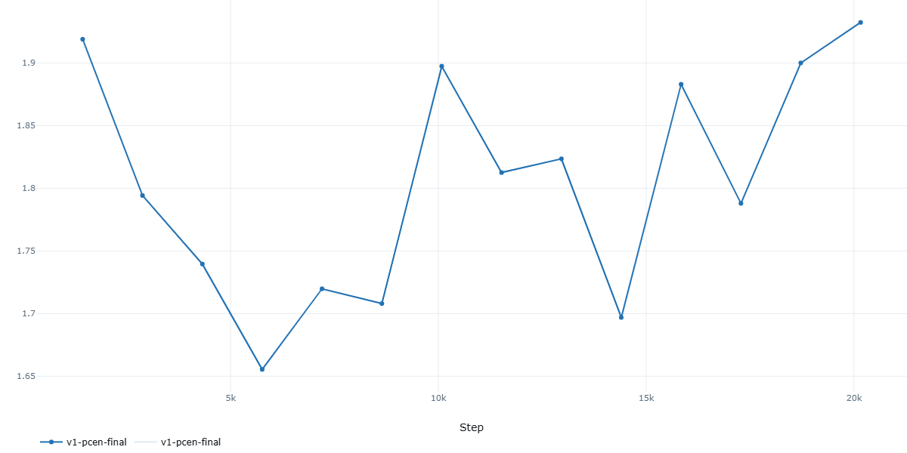
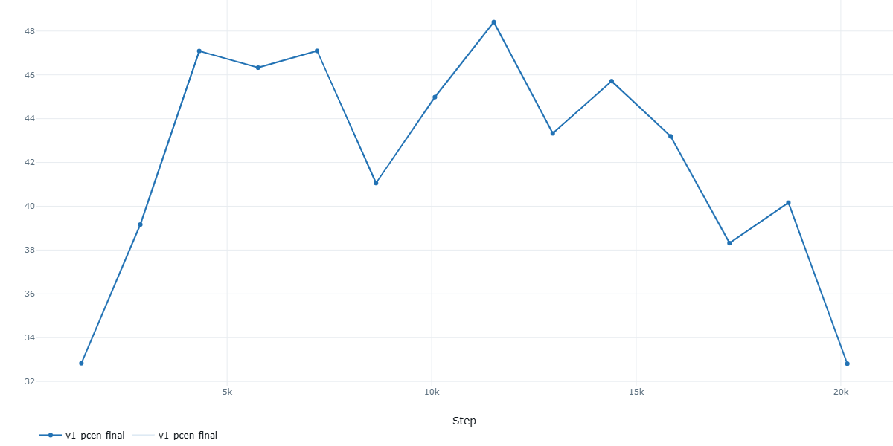
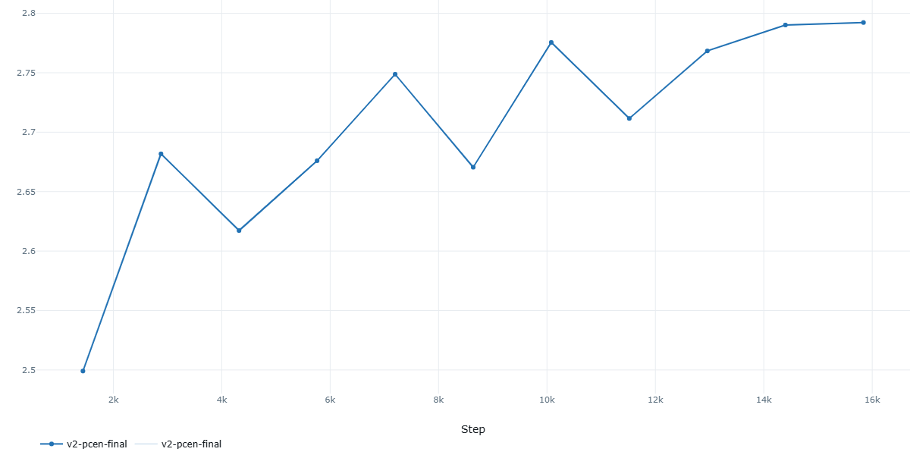
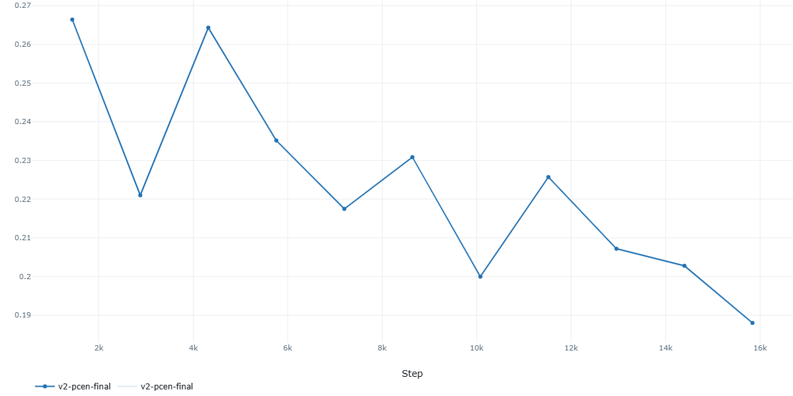

# Model Training Results - Final Summary

> **Project:** DCASE Few-Shot Bioacoustic Event Detection  
> **Date:** January 2026  
> **Author:** [Diksha Prasad]

---

## 📊 Results Overview

| Model | Feature Type | Best Val F-measure | Best Epoch | Status |
|-------|--------------|-------------------|------------|--------|
| **V1** | Log-Mel | **46%** | - | ✅ Completed |
| **V1** | PCEN | **48%** | - | ✅ Completed |
| **V2** | PCEN | **26%** → 18% | Degrading | ⚠️ Overfitting |

---

## 🏆 Best Model: V1 PCEN (48%)

The V1 architecture with PCEN features achieved the best performance.

---

## 1. V1 Log-Mel

### Training Command
```bash
g5 train v1 --exp-name v1-logmel-final features.feature_types=logmel
```

### Training Parameters

| Category | Parameter | Value |
|----------|-----------|-------|
| **Model** | Architecture | V1 (Conv4/ResNet) |
| | Encoder Type | resnet |
| | Embedding Dim | 2048 |
| | Distance Metric | euclidean |
| | Dropout | 0.1 |
| | Non-linearity | leaky_relu |
| | Layer 4 | false |
| **Features** | Type | log-mel |
| | Sample Rate | 22050 Hz |
| | N-Mels | 128 |
| | N-FFT | 1024 |
| | Hop Length | 256 |
| | F-min | 50 Hz |
| | F-max | 11025 Hz |
| **Episodes** | N-way | 10 |
| | K-shot | 5 |
| | N-query | 5 |
| | Episodes/Epoch | 2000 |
| | Val Episodes | 200 |
| **Training** | Learning Rate | 0.001 |
| | Weight Decay | 1e-4 |
| | Max Epochs | 200 |
| | Optimizer | AdamW |
| | Scheduler | StepLR |
| | Scheduler Gamma | 0.65 |
| | Step Size | 10 |
| | Negative Contrast | ✅ Enabled |
| | Seed | 1234 |

### Results

| Metric | Value |
|--------|-------|
| **Best Val F-measure** | **46%** |
| Training Status | Completed |

### MLflow Metrics Screenshots

<!-- INSERT SCREENSHOT: V1 Log-Mel Training Loss Curve -->


<!-- INSERT SCREENSHOT: V1 Log-Mel Validation Accuracy -->


---

## 2. V1 PCEN ⭐ (Best Model)

### Training Command
```bash
g5 train v1 --exp-name v1-pcen-final features.feature_types=pcen
```

### Training Parameters

| Category | Parameter | Value |
|----------|-----------|-------|
| **Model** | Architecture | V1 (Conv4/ResNet) |
| | Encoder Type | resnet |
| | Embedding Dim | 2048 |
| | Distance Metric | euclidean |
| | Dropout | 0.1 |
| | Non-linearity | leaky_relu |
| | Layer 4 | false |
| **Features** | Type | **PCEN** |
| | Sample Rate | 22050 Hz |
| | N-Mels | 128 |
| | N-FFT | 1024 |
| | Hop Length | 256 |
| | F-min | 50 Hz |
| | F-max | 11025 Hz |
| **Episodes** | N-way | 10 |
| | K-shot | 5 |
| | N-query | 5 |
| | Episodes/Epoch | 2000 |
| | Val Episodes | 200 |
| **Training** | Learning Rate | 0.001 |
| | Weight Decay | 1e-4 |
| | Max Epochs | 200 |
| | Optimizer | AdamW |
| | Scheduler | StepLR |
| | Scheduler Gamma | 0.65 |
| | Step Size | 10 |
| | Negative Contrast | ✅ Enabled |
| | Seed | 1234 |

### Results

| Metric | Value |
|--------|-------|
| **Best Val F-measure** | **48%** ⭐ |
| Training Status | Completed |
| Improvement over Log-Mel | +2% |

### MLflow Metrics Screenshots

<!-- INSERT SCREENSHOT: V1 PCEN Training Loss Curve -->


<!-- INSERT SCREENSHOT: V1 PCEN Validation Accuracy -->


---

## 3. V2 PCEN ⚠️ (Overfitting)

### Training Command
```bash
g5 train v2 --exp-name v2-pcen-final features.feature_types=pcen
```

### Training Parameters

| Category | Parameter | Value |
|----------|-----------|-------|
| **Model** | Architecture | V2 (ResNet + Attention) |
| | Encoder Type | resnet_attention |
| | Embedding Dim | 1024 |
| | Distance Metric | **learnable** (MLP) |
| | Channels | [32, 64, 128, 256] |
| | Dropout | 0.1 |
| | Attention | Channel + Temporal |
| **Features** | Type | PCEN |
| | Sample Rate | 22050 Hz |
| | N-Mels | 128 |
| | N-FFT | 1024 |
| | Hop Length | 256 |
| **Augmentation** | SpecAugment | ✅ Enabled |
| | Time Mask % | 15% |
| | Freq Mask % | 15% |
| | Gaussian Noise | ✅ Enabled |
| **Episodes** | N-way | 10 |
| | K-shot | 5 |
| | N-query | 5 |
| | Episodes/Epoch | 2000 |
| | Val Episodes | 200 |
| **Training** | Learning Rate | 0.001 |
| | Weight Decay | 1e-4 |
| | Max Epochs | 50 |
| | Optimizer | AdamW |
| | Scheduler | **CosineAnnealingLR** |
| | Gradient Clip | 1.0 |
| | Negative Contrast | ✅ Enabled |
| | Seed | 1234 |

### Results

| Metric | Value |
|--------|-------|
| Initial Val F-measure | 26% |
| Final Val F-measure | **18%** (degraded) |
| Training Status | Stopped (overfitting) |

### Why V2 Failed

| Issue | Description |
|-------|-------------|
| **Over-complexity** | ResNet + Attention too deep for 174-file dataset |
| **Learnable Distance** | MLP distance metric needs more data |
| **Augmentation Conflict** | SpecAugment on PCEN may destroy signal |
| **Missing Eval** | No DCASE F-measure validation loop |

### MLflow Metrics Screenshots

<!-- INSERT SCREENSHOT: V2 PCEN Training Loss (Diverging) -->


<!-- INSERT SCREENSHOT: V2 PCEN Validation Accuracy (Dropping) -->


---

## 📈 Architecture Comparison

### V1 vs V2 Architecture Differences

| Aspect | V1 | V2 |
|--------|-----|-----|
| Encoder | Simple Conv4/ResNet | Deep ResNet + Attention |
| Parameters | ~0.5M | ~3M |
| Distance | Fixed Euclidean | Learnable MLP |
| Augmentation | None | SpecAugment + Noise |
| L2 Normalization | No | Yes |
| Scheduler | StepLR | CosineAnnealing |
| Val F-measure Eval | ✅ Yes | ❌ Missing |
| Max Epochs | 200 | 50 |

### Why V1 Works Better for This Dataset

1. **Simpler architecture** suits small dataset (174 training files)
2. **Fixed Euclidean distance** is stable and well-proven
3. **No augmentation** avoids signal distortion
4. **Built-in DCASE F-measure evaluation** during validation

---

*Generated: January 2026*

